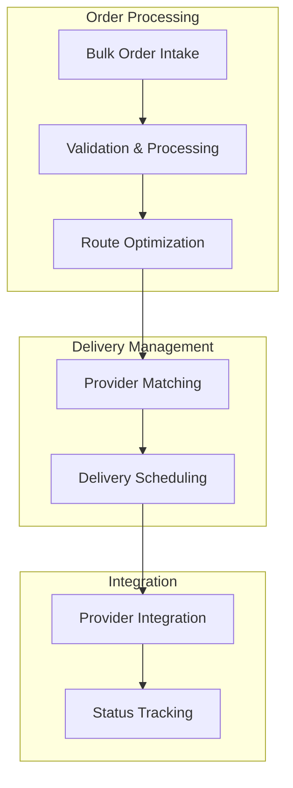

# Phase 1 Architecture

## System Overview
Our initial architecture focuses on three core components that work together to handle bulk deliveries efficiently.

## Core Components

### 1. Order Processing
Simple yet effective order management:
- Bulk file upload handling
- Data validation
- Order grouping
- Status management

### 2. Route Optimization
Focused on practical delivery grouping:
- Geographic clustering
- Time window management
- Priority handling
- Basic route planning

### 3. Provider Integration
Direct integration with delivery partners:
- Quote retrieval
- Order submission
- Status updates
- Error handling

## Data Flow
1. Merchant uploads bulk orders
2. System validates and processes orders
3. Orders are grouped by geography and time
4. Routes are optimized for efficiency
5. Best providers are selected
6. Orders are submitted to providers
7. Status updates flow back to merchant

## Technical Considerations

### Performance
- Bulk processing optimization
- Efficient database queries
- Caching where beneficial
- Background job processing

### Reliability
- Input validation
- Error handling
- Retry mechanisms
- Status monitoring

### Scalability
- Designed for growth
- Simple to maintain
- Easy to enhance
- Clear upgrade paths
