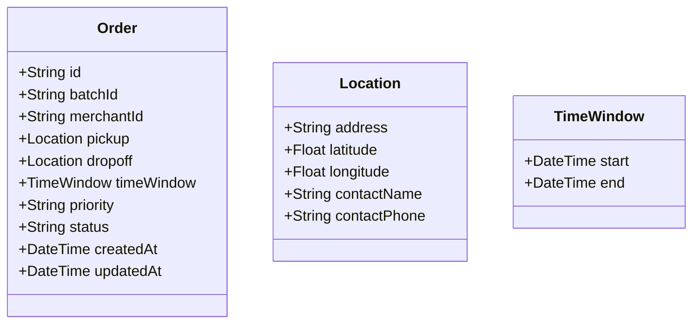
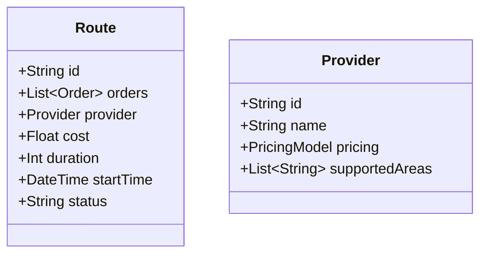

# Data Models

## Core Models

### Order

### Route

## Data Validation

### Order Validation
- Required fields
  - merchantId
  - pickup.address
  - dropoff.address
  - timeWindow
- Optional fields
  - priority (default: normal)
  - batchId

### Route Validation
- Required fields
  - orders (min: 1)
  - provider
- Optional fields
  - startTime (default: ASAP)

## Status Flows

### Order Status
1. PENDING
2. PROCESSING
3. OPTIMIZED
4. ASSIGNED
5. IN_PROGRESS
6. COMPLETED
7. FAILED

### Route Status
1. PLANNING
2. OPTIMIZED
3. ASSIGNED
4. IN_PROGRESS
5. COMPLETED
6. FAILED
