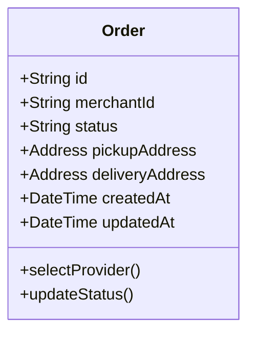
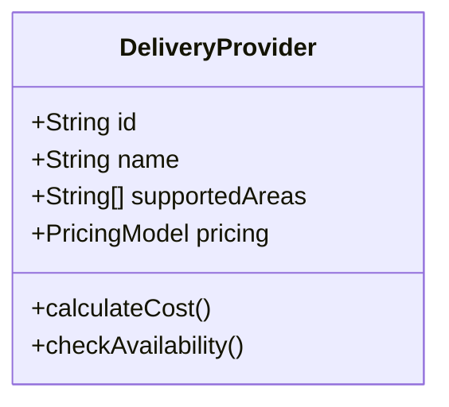

# Data Models

## Core Models

### Order

```mermaid
classDiagram
    class Order {
        +String id
        +String merchantId
        +String status
        +Address pickupAddress
        +Address deliveryAddress
        +DateTime createdAt
        +DateTime updatedAt
        +selectProvider()
        +updateStatus()
    }
```

### Delivery Provider

```mermaid
classDiagram
    class DeliveryProvider {
        +String id
        +String name
        +String[] supportedAreas
        +PricingModel pricing
        +calculateCost()
        +checkAvailability()
    }
```

## Relationships
Describes how different models interact with each other.
