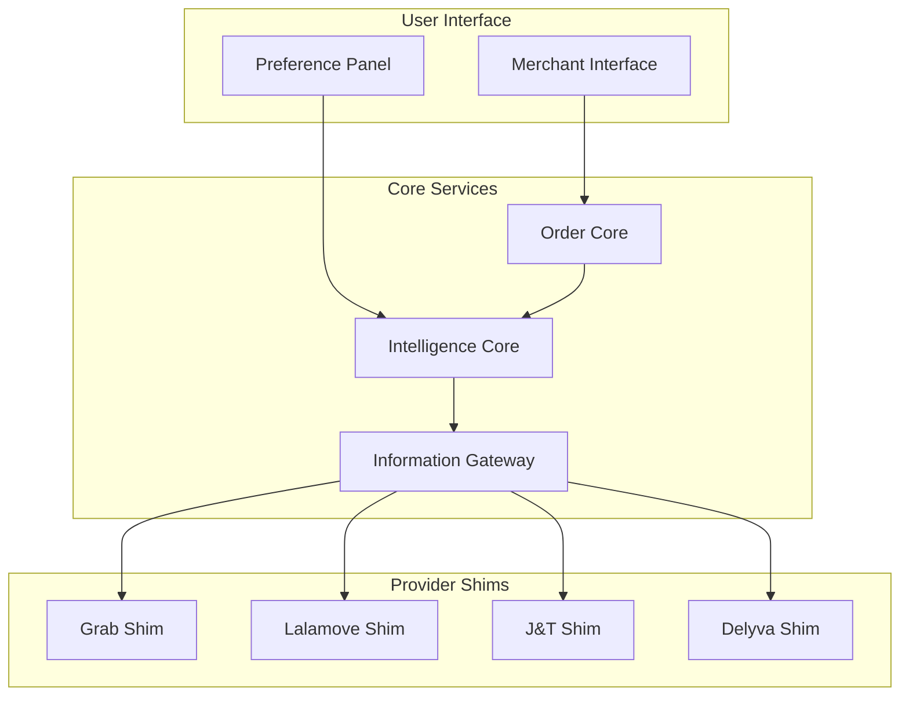

# System Architecture

## Overview
This document outlines the high-level architecture of our delivery aggregator platform.

## Components

### Intelligence Core
The central decision-making system that optimizes delivery provider selection.

### Order Core
Manages order lifecycle and state transitions.

### Information Gateway
Handles communication with external delivery service providers.

## Architecture Diagram

## Component Details
Each component is designed to be independently scalable and maintainable.
