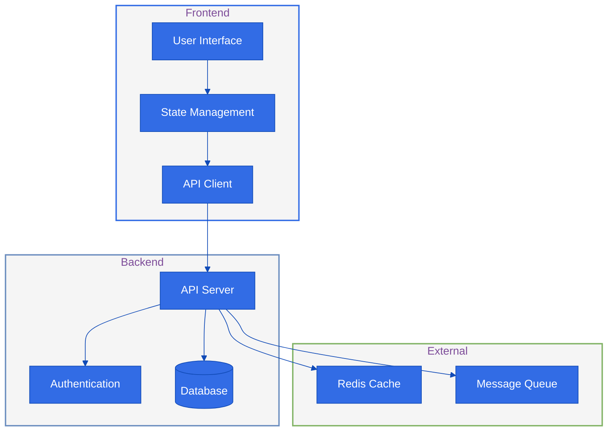

# Technical Decision Record Template

## Decision Overview
**Topic**: [Technology/Architecture/Framework Decision]
**Date**: [YYYY-MM-DD]
**Status**: [Proposed/Accepted/Deprecated/Superseded]

## Context
[What is the issue that we're seeing that is motivating this decision or change?]

## Options Considered
### Option 1: [Option Name]
- **Pros**:
  - [Pro 1]
  - [Pro 2]
- **Cons**:
  - [Con 1]
  - [Con 2]
- **Costs/Resources**:
- **Implementation Complexity**:

### Option 2: [Option Name]
[Same structure as Option 1]

## Decision
**Chosen Option**: [Option Name]
**Justification**:
- [Key reason 1]
- [Key reason 2]

## Technical Implementation

## Migration Strategy
1. **Phase 1**: [Description]
   - Tasks:
   - Timeline:
2. **Phase 2**: [Description]
   - Tasks:
   - Timeline:

## Success Criteria
- [ ] Performance metrics
- [ ] Reliability targets
- [ ] Scalability goals

## Monitoring Plan
- **Metrics to Track**:
- **Alert Thresholds**:
- **Review Schedule**:

## References
- [Technical documentation]
- [Research papers]
- [Similar implementations]
