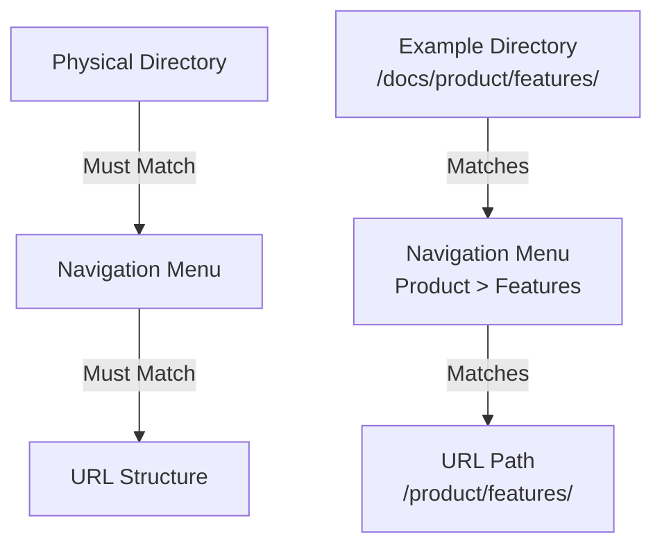

# Documentation Structure Context

## Core Principle
The navigation structure in the live documentation MUST exactly match the physical directory structure. This 1:1 mapping is non-negotiable and helps maintain clarity for all stakeholders.

## Key Rules

### 1. Directory-Navigation Mapping


### 2. File Organization
- Every directory should have an `index.md`
- File names should match their navigation labels
- Use kebab-case for file names (e.g., `user-guide.md`)
- Keep nesting depth reasonable (max 3-4 levels)

### 3. Navigation Structure
- MkDocs navigation in `mkdocs.yml` must reflect directory structure
- Section names in navigation must match directory names
- No hidden files or directories (everything in nav must exist in filesystem)

## Examples

### ✅ Correct Structure
```yaml
# Directory Structure
docs/
  ├── product/
  │   ├── index.md
  │   └── features/
  │       └── index.md
  └── we-and-ai/
      ├── index.md
      └── context-web/
          ├── index.md
          └── contexts/
              └── documentation.md

# MkDocs Navigation
nav:
  - Product:
    - Overview: product/index.md
    - Features: product/features/index.md
  - We & AI:
    - Overview: we-and-ai/index.md
    - Context Web:
      - Overview: we-and-ai/context-web/index.md
      - Contexts:
        - Documentation: we-and-ai/context-web/contexts/documentation.md
```

### ❌ Incorrect Structure
```yaml
# WRONG: Navigation doesn't match directories
nav:
  - Product Info:  # Should be "Product" to match directory
    - Main: product/index.md  # Should be "Overview" to match content
  - AI:  # Should be "We & AI" to match directory
    - Contexts:  # Missing intermediate "Context Web" level
      - Doc Guide: we-and-ai/context-web/contexts/documentation.md  # Name doesn't match file
```

## Benefits

### 1. Clarity
- Immediate understanding of document location
- Easy mental mapping between navigation and files
- Reduced cognitive load when searching

### 2. Maintainability
- Simple to add new content in correct location
- Easy to spot misplaced files
- Straightforward link management

### 3. Onboarding
- New team members can quickly understand structure
- AI assistants can reliably locate files
- Reduced confusion about document organization

## Implementation Guide

### When Adding New Content
1. Create directory structure first
2. Add corresponding navigation in `mkdocs.yml`
3. Verify 1:1 mapping
4. Add content files
5. Test navigation in live docs

### When Reorganizing
1. Plan new structure
2. Update directories and files
3. Update `mkdocs.yml` to match exactly
4. Update internal links
5. Verify in live docs

## Common Issues

### Navigation Drift
When navigation structure gradually diverges from directory structure:
- Regular audits to ensure alignment
- Automated checks for structure matching
- Immediate correction of any mismatches

### Broken Links
Caused by moving files without updating structure:
- Always move both file and nav entry
- Update all internal links
- Use relative paths when possible

## Version History
- v1.0.0 (2024-12-11): Initial version
  - Core principle established
  - Examples and benefits documented
  - Implementation guide added
