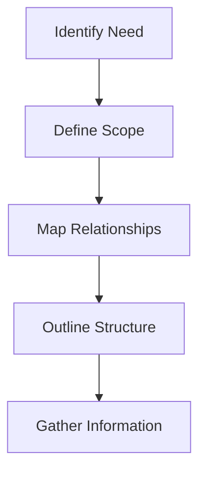

# Creating AI Knowledge Contexts

## Purpose
This guide defines how to create effective AI Knowledge Contexts that serve as foundational understanding frameworks. These contexts help AI systems better comprehend and operate within specific domains of the project.

## Context Structure Guidelines

### 1. Core Components

#### Header Section
- Clear title identifying the context domain
- Brief overview of the context's purpose
- Timestamp of last update
- Version tracking

#### Conceptual Framework
- Key concepts and their definitions
- Fundamental principles
- Critical assumptions
- Domain boundaries

#### Relationship Mapping
- Internal relationships within the context
- External connections to other contexts
- Dependency chains and influence flows
- Integration points

#### Implementation Impact
- How this context affects decision-making
- Practical application guidelines
- Success metrics and evaluation criteria
- Usage patterns

### 2. Writing Style

#### Clarity
- Use clear, unambiguous language
- Define technical terms
- Provide examples where helpful
- Maintain consistent terminology

#### Structure
- Hierarchical organization
- Logical flow of information
- Clear section headings
- Progressive disclosure

#### Completeness
- Cover all essential aspects
- Include edge cases
- Note limitations
- Document assumptions

### 3. Context Types

#### Technical Contexts
- System architecture
- Code patterns
- Performance considerations
- Security requirements

#### Product Contexts
- User needs
- Feature specifications
- Market requirements
- Success criteria

#### Business Contexts
- Strategic goals
- Resource constraints
- Timeline requirements
- Success metrics

## Creation Process

### 1. Planning


1. **Identify Need**
   - What problem does this context solve?
   - Who will use this context?
   - When will it be used?

2. **Define Scope**
   - Core concepts to cover
   - Boundaries and limitations
   - Integration points

3. **Map Relationships**
   - Dependencies on other contexts
   - Impact on existing contexts
   - Cross-context interactions

### 2. Writing

#### First Draft
1. Follow the structure guidelines
2. Focus on clarity and completeness
3. Include all core components
4. Add relevant examples

#### Review and Refinement
1. Check for clarity and consistency
2. Verify relationships
3. Test with example scenarios
4. Get peer review

### 3. Integration

#### Documentation
1. Add to Context Web index
2. Update related contexts
3. Create navigation links
4. Add search keywords

#### Usage Guidelines
1. When to load this context
2. How to apply insights
3. Common patterns
4. Edge cases

## Maintenance

### Regular Updates
1. **Review Schedule**
   - Monthly content review
   - Quarterly relationship check
   - Annual deep review

2. **Update Triggers**
   - New related features
   - Changed requirements
   - User feedback
   - Usage patterns

### Version Control
1. **Change Tracking**
   - Version numbers
   - Change descriptions
   - Impact assessment
   - Migration notes

2. **Compatibility**
   - Backward compatibility
   - Breaking changes
   - Transition guides
   - Legacy support

## Example Context Template

```markdown
# [Context Name]

## Purpose
[Brief description of what this context is for and why it exists]

## Core Concepts
- Concept 1: [Definition]
- Concept 2: [Definition]
- ...

## Relationships
- Depends on: [Context A], [Context B]
- Influences: [Context X], [Context Y]
- Related to: [Context Z]

## Implementation
- Use cases
- Guidelines
- Best practices
- Success metrics

## Version History
- v1.0.0 (YYYY-MM-DD): Initial version
- v1.1.0 (YYYY-MM-DD): [Changes]
```

## Quick Reference

### Creation Checklist
- [ ] Clear purpose defined
- [ ] Core concepts identified
- [ ] Relationships mapped
- [ ] Structure follows guidelines
- [ ] Examples included
- [ ] Review completed
- [ ] Integration planned
- [ ] Maintenance scheduled

### Common Pitfalls
1. Too broad or vague
2. Missing key relationships
3. Incomplete examples
4. Unclear boundaries
5. Poor maintenance plan

[Back to Index →](index.md)
