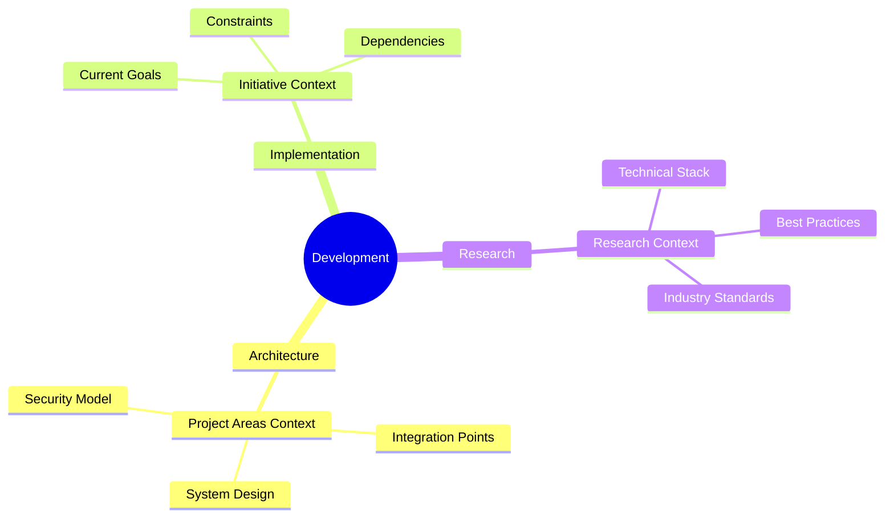
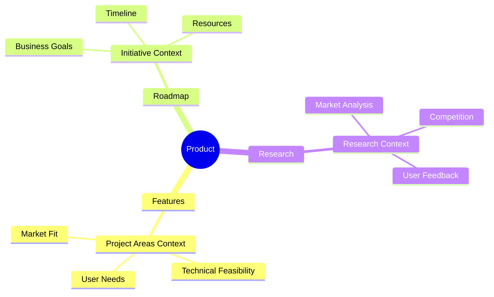
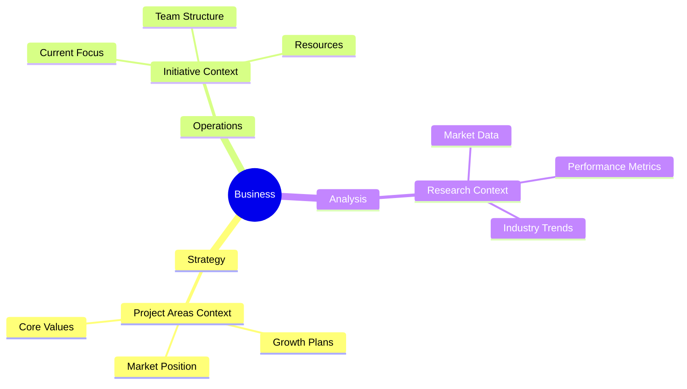

# Context Web Index

> "Your guide to finding the right context for any task"

## How to Use This Index

1. **Identify Task Type**: Determine what kind of task you're working on
2. **Find Related Contexts**: Use the maps below to find relevant contexts
3. **Load Contexts**: Review and load the identified contexts
4. **Apply Insights**: Use the context to inform your work

## Task Type Maps

### Development Tasks

### Product Tasks

### Business Tasks

## Context Quick Reference

### Project Areas Context
- **Use for**: Understanding system scope, architecture, and relationships
- **Key aspects**: System design, integration points, user needs
- **When to load**: Starting new features, planning architecture
- [Go to Context →](../context/project-areas.md)

### Initiative Context
- **Use for**: Current goals, constraints, and timelines
- **Key aspects**: Business objectives, technical requirements, resources
- **When to load**: Planning sprints, implementing features
- [Go to Context →](../context/initiative.md)

### Research Context
- **Use for**: Technical decisions, market understanding
- **Key aspects**: Technical stack, best practices, market analysis
- **When to load**: Making technical choices, analyzing market
- [Go to Context →](../context/research.md)

## Common Task Patterns

### Starting New Feature
1. Load Project Areas Context → Understand system scope
2. Load Initiative Context → Check current priorities
3. Load Research Context → Review best practices

### Making Technical Decisions
1. Load Research Context → Check industry standards
2. Load Project Areas Context → Review system constraints
3. Load Initiative Context → Verify alignment with goals

### Planning Roadmap
1. Load Initiative Context → Understand current focus
2. Load Project Areas Context → Check system capabilities
3. Load Research Context → Consider market trends

## Context Loading Rules

1. **Always Start Fresh**: Reload contexts for each new task
2. **Load in Order**: Follow the sequence in task patterns
3. **Keep Updated**: Check for context updates regularly
4. **Cross-Reference**: Use multiple contexts when needed

## Tips for Effective Use

1. **Start Broad**: Begin with high-level context
2. **Drill Down**: Move to specific details as needed
3. **Stay Current**: Keep contexts in mind throughout task
4. **Update When Needed**: Contribute new insights back to contexts

[View Contexts →](../context/project-areas.md)
