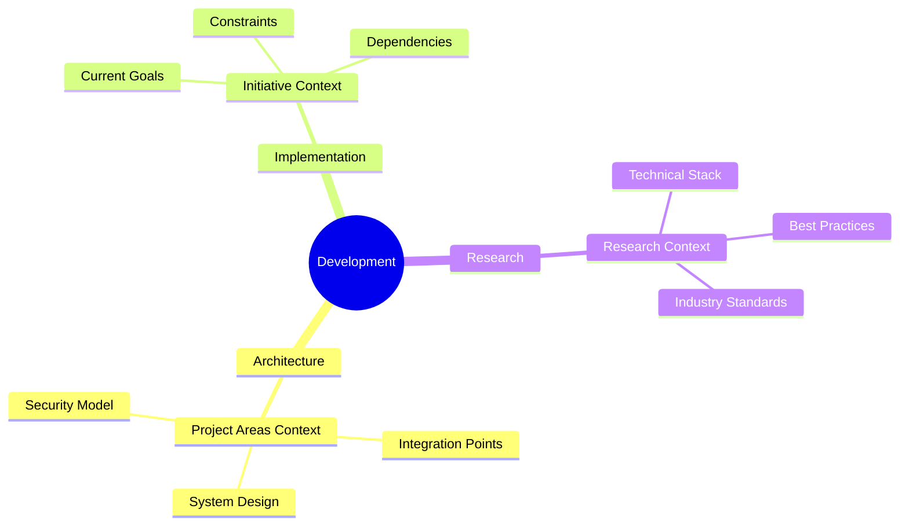
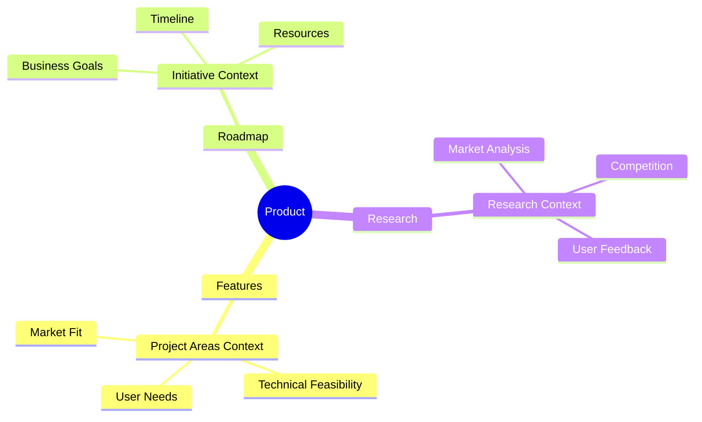
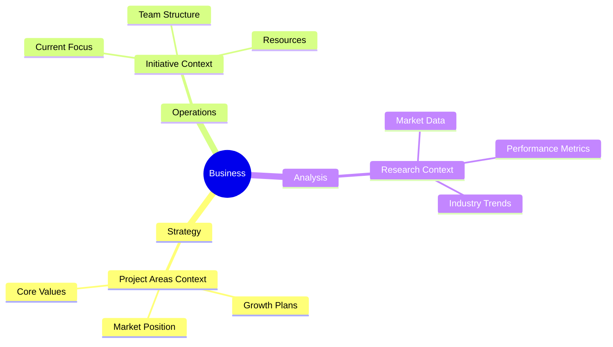

# Context Web Index

> "Your guide to finding the right context for any task"

## Available Contexts

### Project Areas
Understanding system scope, architecture, and relationships
[View Context →](contexts/project-areas.md)

### Initiative
Current goals, constraints, and timelines
[View Context →](contexts/initiative.md)

### Research
Technical decisions and market understanding
[View Context →](contexts/research.md)

### Users
User needs, behaviors, and expectations
[View Context →](contexts/users.md)

### Documentation
Documentation structure and organization principles
[View Context →](contexts/documentation.md)

## How to Use Contexts

1. **Identify Task Type**: Determine what kind of task you're working on
2. **Find Related Contexts**: Use the maps below to find relevant contexts
3. **Load Contexts**: Review and load the identified contexts
4. **Apply Insights**: Use the context to inform your work

## Task Type Maps

### Development Tasks

### Product Tasks

### Business Tasks

## Common Task Patterns

### Starting New Feature
1. Load Project Areas Context → Understand system scope
2. Load Initiative Context → Check current priorities
3. Load Research Context → Review best practices

### Making Technical Decisions
1. Load Research Context → Check industry standards
2. Load Project Areas Context → Review system constraints
3. Load Initiative Context → Verify alignment with goals

### Planning Roadmap
1. Load Initiative Context → Understand current focus
2. Load Project Areas Context → Check system capabilities
3. Load Research Context → Consider market trends

## Tips for Effective Use

1. **Start Broad**: Begin with high-level context
2. **Drill Down**: Move to specific details as needed
3. **Stay Current**: Keep contexts in mind throughout task
4. **Update When Needed**: Contribute new insights back to contexts

## Automated Context Scanning

I automatically scan this Context Web index for every interaction to ensure relevant contexts are loaded. This process includes:

1. **Task Analysis**: Identifying the type of task from user input
2. **Context Loading**: Loading primary and supporting contexts
3. **Application**: Applying context insights to responses

[Need to create a new context? Check the process guide →](../process.md#creating-contexts)
