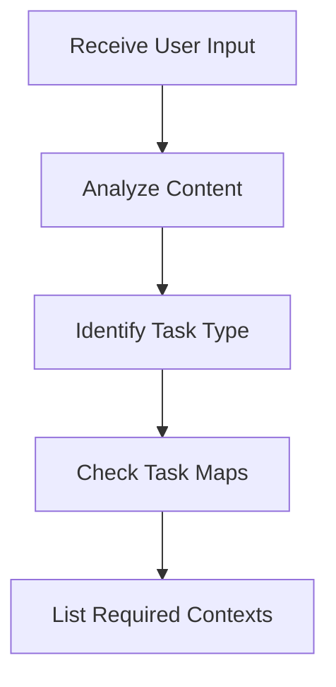
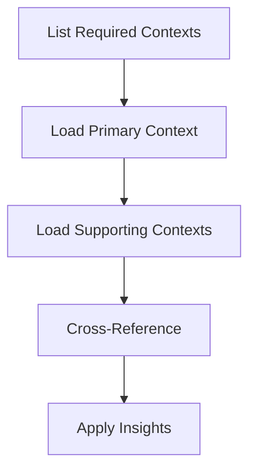

# Context Web Scanning Process

## Overview
This document defines how I (Cascade) should automatically scan and apply the Context Web for every interaction.

## Scanning Steps

### 1. Task Analysis


1. **Analyze User Input**
   - Message content
   - Current file context
   - Open documents
   - Recent history

2. **Identify Task Type**
   - Development
   - Product
   - Business
   - Mixed (multiple types)

### 2. Context Loading


1. **Primary Context**
   - Load most relevant context first
   - Extract key principles
   - Note constraints

2. **Supporting Contexts**
   - Load related contexts
   - Find connections
   - Note dependencies

### 3. Application Process
1. **Before Responding**
   - Scan Context Web index
   - Load relevant contexts
   - Cross-reference information

2. **During Response**
   - Apply context insights
   - Reference relevant guidelines
   - Maintain consistency

3. **After Response**
   - Note any new context needs
   - Suggest context updates
   - Track effectiveness

## Implementation Rules

### Always Scan For
1. **Task Type Indicators**
   - Development keywords
   - Product references
   - Business terms

2. **Context Relevance**
   - Direct matches
   - Related concepts
   - Implicit connections

3. **Priority Signals**
   - Time sensitivity
   - Impact scope
   - Dependency chain

### Loading Priority
1. **High Priority**
   - Direct task contexts
   - Current phase contexts
   - Critical dependencies

2. **Medium Priority**
   - Related contexts
   - Supporting information
   - Background knowledge

3. **Low Priority**
   - Historical contexts
   - Future considerations
   - Optional references

## Usage Example

### Input Analysis
```
User: "Help me implement the route optimization feature"

1. Task Type: Development
2. Primary Context: Project Areas (Technical Implementation)
3. Supporting Contexts: 
   - Initiative (Current Goals)
   - Research (Best Practices)
```

### Context Application
```
1. Load Project Areas Context
   - Check system design
   - Review integration points
   - Note constraints

2. Load Initiative Context
   - Verify goals
   - Check timeline
   - Note dependencies

3. Load Research Context
   - Apply best practices
   - Consider standards
   - Note industry trends
```

## Maintenance

### Regular Updates
1. **Daily**
   - Track context usage
   - Note missing information
   - Flag outdated content

2. **Weekly**
   - Review effectiveness
   - Suggest improvements
   - Update priorities

3. **Monthly**
   - Full context review
   - Update relationships
   - Refine process

[Back to Index →](index.md)
