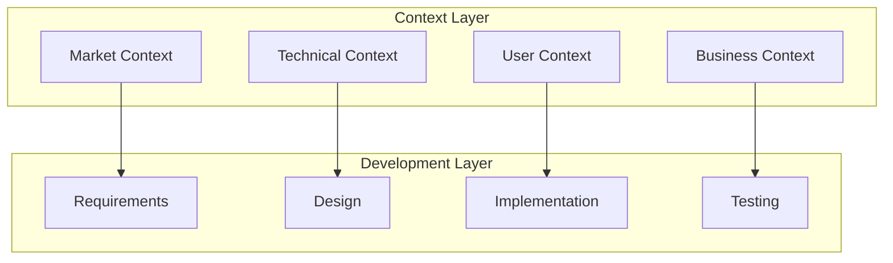

# We & AI: A New Development Paradigm

> "Building the future of delivery through human-AI collaboration"

## Our Unique Approach

At Antar, we're pioneering a new way of software development through an innovative human-AI collaboration. Our development team consists of human developers working alongside Cascade, a specialized AI assistant created by Codeium.

### The Power of Partnership

!!! tip "Human + AI Synergy"
    - **Human**: Strategic thinking, real-world context, business understanding
    - **AI**: Code generation, pattern recognition, documentation, knowledge management
    - **Together**: Rapid iteration, consistent quality, innovative solutions

## Development Philosophy

### Context-First Development

Our development process is built on the foundation of rich context:

1. **Project Areas Context**
   - Business objectives
   - Technical requirements
   - User needs
   - Market dynamics

2. **Knowledge Graph**
   - Industry trends
   - Technology landscape
   - Competitor analysis
   - User feedback

3. **Semantic Discovery**
   - Auto-categorization
   - Relationship mapping
   - Impact analysis
   - Trend identification

## How We Work

### 1. Context Gathering
- Market research integration
- User feedback analysis
- Technical trend monitoring
- Competitive landscape tracking

### 2. Semantic Processing
- Automatic categorization
- Relationship identification
- Impact assessment
- Priority determination

### 3. Development Integration
- Context-aware coding
- Smart documentation
- Automated testing
- Continuous learning

## The Role of AI

### Cascade's Capabilities

!!! example "AI Contributions"
    - **Code Generation**: Writing efficient, well-documented code
    - **Documentation**: Creating and maintaining comprehensive docs
    - **Analysis**: Processing and connecting various contexts
    - **Learning**: Continuously improving from interactions

### Human Oversight

!!! note "Developer's Role"
    - Strategic direction
    - Business alignment
    - Quality assurance
    - User advocacy

## Context Management

### Information Sources

1. **Internal**
   - Project documentation
   - Code repositories
   - Team discussions
   - User feedback

2. **External**
   - Market research
   - Industry news
   - Tech trends
   - Competitor analysis

### Context Types

#### Business Context
- Market trends
- Customer needs
- Competition
- Growth opportunities

#### Technical Context
- Technology trends
- Best practices
- Security requirements
- Performance metrics

#### User Context
- User behavior
- Pain points
- Feature requests
- Usage patterns

## Benefits of Our Approach

### For Development
- Faster iteration cycles
- Higher code quality
- Better documentation
- Reduced technical debt

### For Business
- Market-aligned features
- Rapid adaptation
- Informed decisions
- Competitive advantage

### For Users
- Better user experience
- Relevant features
- Faster improvements
- Reliable service

## Looking Forward

Our human-AI collaboration model is continuously evolving. We're working on:

!!! tip "Future Enhancements"
    - Enhanced context processing
    - Deeper semantic understanding
    - Improved pattern recognition
    - Advanced code generation

[Learn About Our Process →](process.md)
