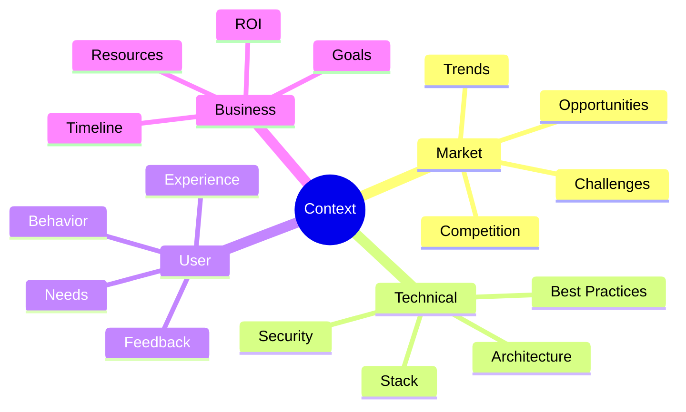

# Our Development Process

## Context-Driven Development

Our development process is built on the foundation of rich, interconnected context that informs every decision and action.

### The Context Web



## How Context Shapes Development

### 1. Discovery Phase

!!! example "Context Gathering"
    ```mermaid
    graph LR
        A[Market Research] --> E[Context Pool]
        B[User Feedback] --> E
        C[Tech Trends] --> E
        D[Business Goals] --> E
        E --> F[Analysis]
        F --> G[Insights]
    ```

- Automated monitoring of industry news
- User feedback collection and analysis
- Technical trend tracking
- Business objective alignment

### 2. Analysis Phase

!!! example "Semantic Processing"
    ```mermaid
    graph TD
        A[Raw Data] --> B[Classification]
        B --> C[Relationship Mapping]
        C --> D[Priority Scoring]
        D --> E[Action Items]
    ```

- Pattern recognition
- Impact assessment
- Priority determination
- Relationship mapping

### 3. Implementation Phase

!!! example "Context-Aware Development"
    ```mermaid
    graph LR
        A[Context] --> B[Design]
        B --> C[Development]
        C --> D[Testing]
        D --> E[Deployment]
        E --> A
    ```

- Context-informed design decisions
- AI-assisted development
- Automated testing
- Continuous feedback

## Creating Contexts

When working with AI, contexts are crucial for ensuring consistent and well-informed decisions. Follow these guidelines when creating new contexts:

### Context Structure
1. **Clear Purpose**
   - What problem does this context solve?
   - Who will use it?
   - When should it be used?

2. **Core Components**
   - Header with title and purpose
   - Key concepts and definitions
   - Relationship mappings
   - Implementation guidelines

3. **Writing Style**
   - Clear, unambiguous language
   - Consistent terminology
   - Practical examples
   - Progressive disclosure

[View full context creation guide →](context-web/creating-contexts.md)

## Semantic Discovery

### Information Categories

1. **Project-Related**
   - Documentation
   - Code
   - Issues
   - Discussions

2. **Market-Related**
   - Industry news
   - Competitor updates
   - Market trends
   - Economic factors

3. **Technology-Related**
   - New technologies
   - Best practices
   - Security updates
   - Performance improvements

4. **User-Related**
   - Feedback
   - Usage patterns
   - Feature requests
   - Pain points

### Discovery Methods

#### Automated Monitoring
- News aggregation
- Social media tracking
- Technical blogs
- Industry reports

#### Pattern Recognition
- Trend identification
- Relationship mapping
- Impact analysis
- Priority scoring

#### Knowledge Integration
- Context categorization
- Information linking
- Insight generation
- Action recommendation

## The Role of AI in Context Management

### Cascade's Responsibilities

1. **Information Processing**
   - Data collection
   - Classification
   - Analysis
   - Synthesis

2. **Pattern Recognition**
   - Trend identification
   - Relationship mapping
   - Impact assessment
   - Priority scoring

3. **Knowledge Management**
   - Documentation
   - Organization
   - Retrieval
   - Updates

### Human Oversight

1. **Strategic Direction**
   - Goal setting
   - Priority alignment
   - Decision making
   - Quality assurance

2. **Context Validation**
   - Accuracy check
   - Relevance assessment
   - Impact evaluation
   - Action approval

## Benefits of Context-Driven Development

### Faster Development
- Informed decisions
- Reduced research time
- Automated processes
- Clear priorities

### Better Quality
- Comprehensive testing
- Consistent documentation
- Best practices
- Security awareness

### Market Alignment
- Trend awareness
- Competitive insight
- User focus
- Business alignment

## Future Enhancements

!!! tip "Upcoming Improvements"
    - Enhanced semantic processing
    - Advanced pattern recognition
    - Deeper context understanding
    - Improved automation

[Back to We & AI →](index.md)
